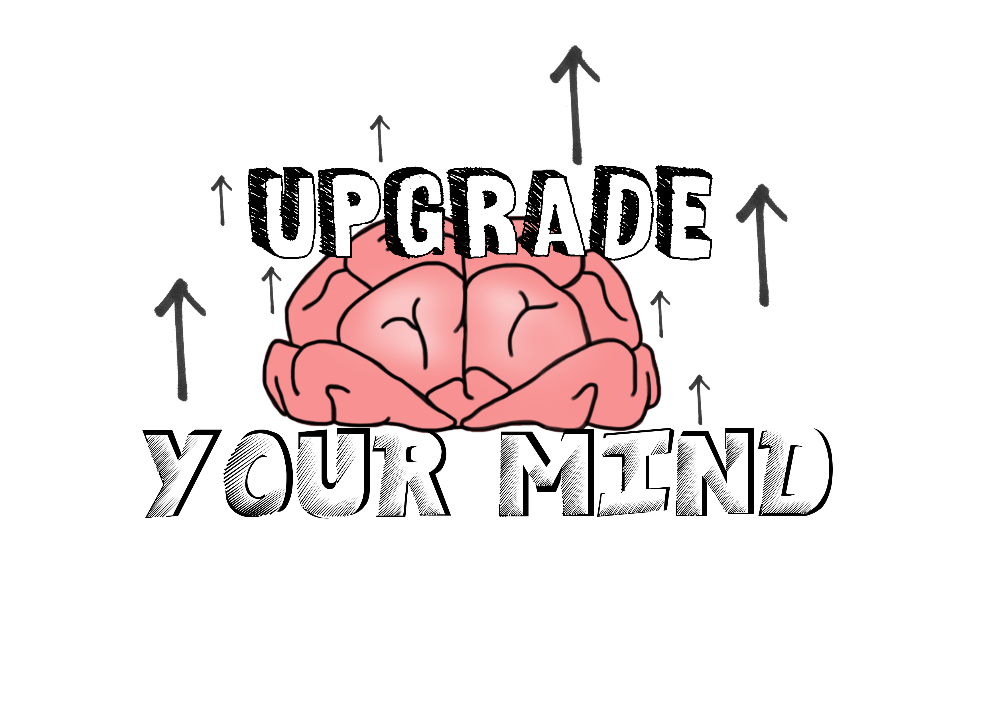

# GitHub Game Off 2016 - Increase your Mind

## *FR*

### Principe du jeu
Increase Your Mind est un jeu médiaval en 2.5D se jouant à deux joueurs en LAN/WAN.  
Le jeu est composé de plusieurs niveaux.  
Pour s'échapper des différents niveaux, les deux joueurs devront s'entraider et communiquer entre eux pour détourner les sorts des créatures pour sortir des différents niveaux.

---
Capacités des joueurs :
- Sauter.
- Grimper sur votre collègue.
- Détourner les attaques des monstres.
- Utiliser un outil.

---

### Niveaux

Un temps sera défini pour chaque niveau.

#### Outils
Les outils pourront être trouvés sur le sol ou en cassant des caisses.

Liste des outils:
- Hache
- Pelle
- ...

#### Ennemis
Les ennemis pourront être contrôlé en fonction de leurs niveaux et celui du joueur.

Liste des enemis:
- Araignée | capacité: lance une toile tissée
- Bombe | capacité: explose
- ...
